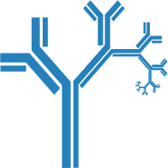

.. Immcantation: An Integrated Framework for Adaptive Immune Receptor Repertoire Analysis
.. keywords:  rep-seq, immuno-seq, vdj-seq, repertoire sequencing, BCR, TCR, Ig, AIRR,
    adaptive immunity, somatic hypermutation, AbSeq, AbPair, VDJ, immunoglobulin

.. toctree::
    :maxdepth: 1
    :hidden:

    Welcome <self>
    Getting Started <intro>
    Contact & Cite <about>
    Contributing <contrib>

.. toctree::
    :maxdepth: 3
    :hidden:
    :caption: Docker Container

    docker/intro
    docker/guide
    docker/pipelines
    docker/news

.. toctree::
    :maxdepth: 1
    :caption: Packages
    :hidden:

    pRESTO <http://presto.readthedocs.io>
    Change-O <http://changeo.readthedocs.io>
    Alakazam <http://alakazam.readthedocs.io>
    SHazaM <http://shazam.readthedocs.io>
    TIgGER <http://tigger.readthedocs.io>
    SCOPer <http://scoper.readthedocs.io>
    
.. toctree::
    :maxdepth: 1
    :caption: Contributed
    :hidden:    

    RDI <http://rdi.readthedocs.io>
    RAbHIT <https://yaarilab.bitbucket.io/RAbHIT/>
    IgPhyML <https://igphyml.readthedocs.io>
    
.. toctree::
    :maxdepth: 1
    :caption: In Development
    :hidden:

    prestoR <packages/prestor>

.. _Welcome:

Welcome to the Immcantation Portal!
==========================================================================================

Advances in high-throughput sequencing technologies now allow for large-scale
characterization of B cell receptor (BCR) and T cell receptor (TCR) repertoires. The high
germline and somatic diversity of the adaptive immune receptor repertoire (AIRR) presents
challenges for biologically meaningful analysis - requiring the development of specialized
computational methods.

The Immcantation framework provide a start-to-finish analytical ecosystem for
high-throughput AIRR-seq datasets. Beginning from raw reads, Python and R packages are
provided for pre-processing, population structure determination, and repertoire analysis.

Component Packages
-----------------------------------------------------------------------------------------

**Click on the images below for more details.**

.. list-table::
   :widths: 50 50

   * - |presto-img|
     - **pRESTO**

       + Quality control
       + Read assembly
       + UMI processing
       + Error profiling

   * - |changeo-img|
     - **Change-O**

       + V(D)J reference alignment standardization
       + Clonal clustering
       + Germline reconstruction
       + Conversion and annotation

   * - |alakazam-img|
     - **Alakazam**

       + Clonal lineage reconstruction
       + Lineage topology analysis
       + Repertoire diversity
       + V(D)J gene usage
       + Physicochemical property analysis

   * - |shazam-img|
     - **SHazaM**

       + Mutation profiling
       + Selection pressure quantification
       + Empirical SHM models
       + Chimera detection
       + Clonal clustering threshold tuning

   * - |tigger-img|
     - **TIgGER**

       + Novel polymorphism detection
       + Genotyping

   * - |rdi-img|
     - **RDI**

       + Repertoire Dissimilarity Index

   * - |scoper-img|
     - **SCOPer**

       + Spectral clonal clustering methods

   * - |prestoR-img|
     - **prestoR**

       + pRESTO report generation

   * - |igphyml-img|
     - **IgPhyML**

       + Clonal lineage tree contruction
       + Mutation/selection hypothesis testing       

.. Image substitutions

.. |presto-img| image:: _static/presto.png
    :align: middle
    :width: 200
    :target: pRESTO_

.. |changeo-img| image:: _static/changeo.png
    :align: middle
    :width: 200
    :target: Change-O_

.. |alakazam-img| image:: _static/alakazam.png
    :align: middle
    :width: 200
    :target: Alakazam_

.. |shazam-img| image:: _static/shazam.png
    :align: middle
    :width: 200
    :target: SHazaM_

.. |tigger-img| image:: _static/tigger.png
    :align: middle
    :width: 200
    :target: TIgGER_

.. |rdi-img| image:: _static/rdi.png
    :align: middle
    :width: 200
    :target: RDI_

.. |scoper-img| image:: _static/scoper.png
    :align: middle
    :width: 200
    :target: SCOPer_

.. |prestoR-img| image:: _static/prestoR.png
    :align: middle
    :width: 200
    :target: prestoR_

.. Doc links

.. _pRESTO: http://presto.readthedocs.io
.. _Change-O: http://changeo.readthedocs.io
.. _Alakazam: http://alakazam.readthedocs.io
.. _SHazaM: http://shazam.readthedocs.io
.. _TIgGER: http://tigger.readthedocs.io
.. _RDI: http://rdi.readthedocs.io
.. _SCOPer: http://scoper.readthedocs.io
.. _prestoR: packages/prestor.html
.. _igphyml: http://igphyml.readthedocs.io
